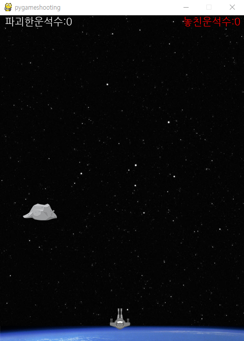
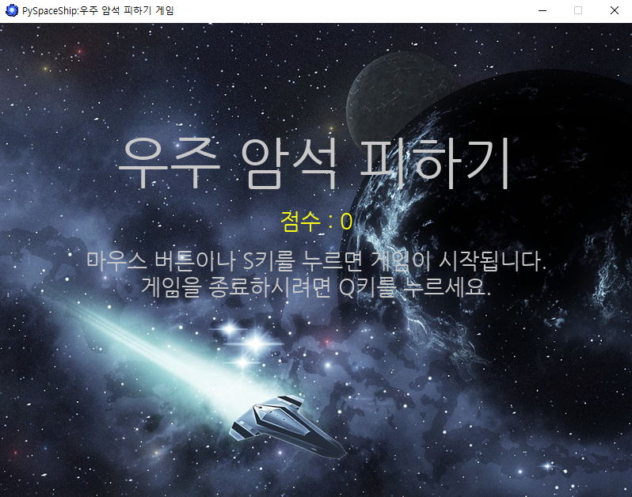
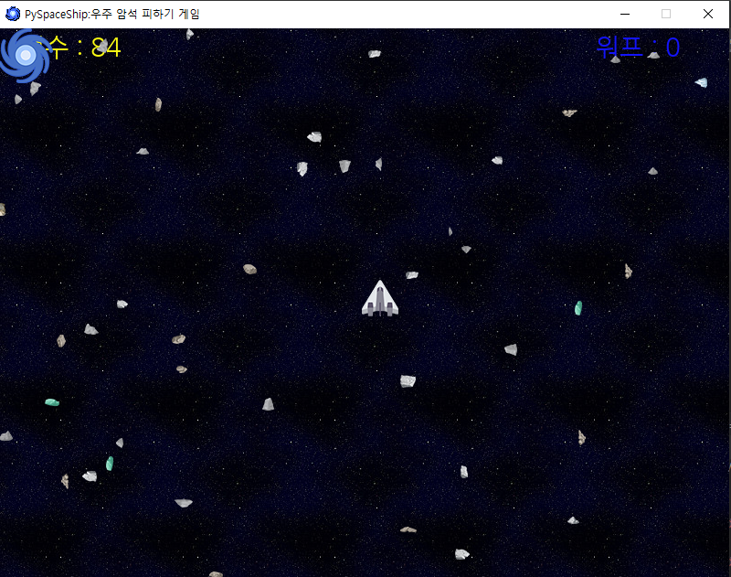
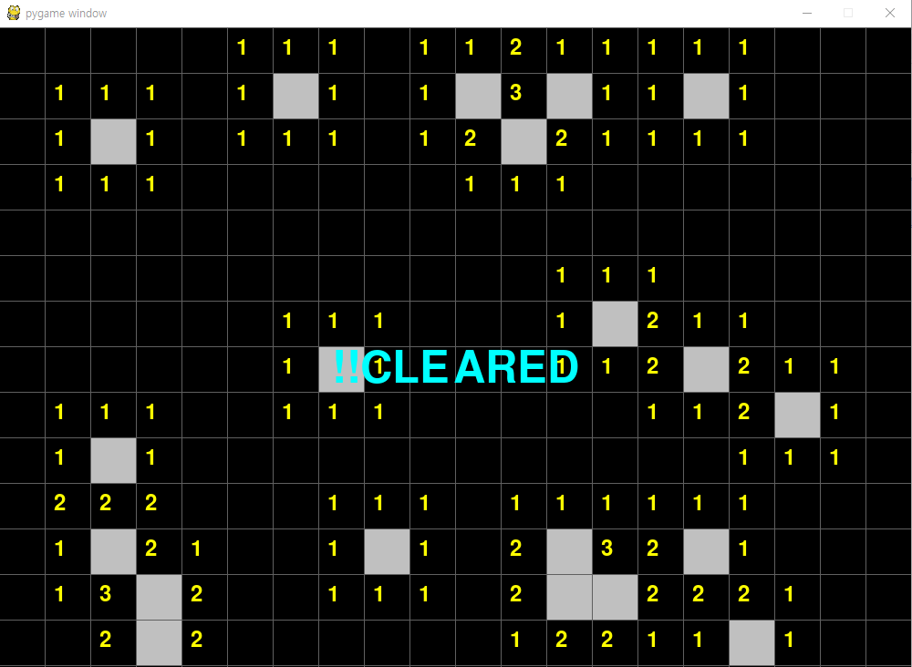
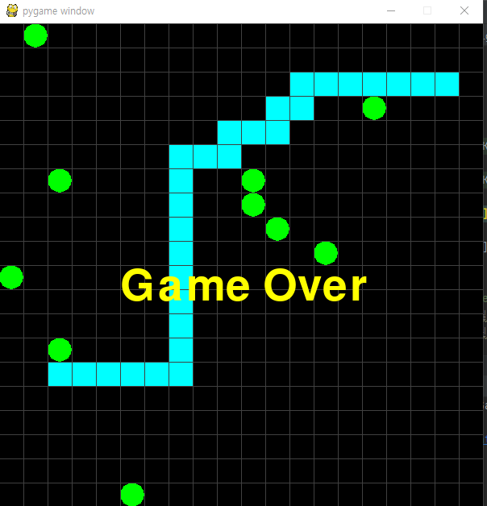

# Pyguette
Pygame Track

 ### 직접만들어보는 파이게임
 
 + [주요코드 먼저 알아보기](./PygamePrac/PygameZero.py)
 
###출처 : [이수안랩유튜브강의](https://www.youtube.com/watch?v=-e_5sOsKqrU&feature=emb_logo)  / [이수안랩바로가기](http://suanlab.com/)

키보드를 이용하여 나오는 운석들을 격파하는 게임입니다. 점수가높아질수록 속도가 높아지고
놓치는 운석의 갯수가 지정된 커트라인보다 더 많이 놓치거나 운석과 비행기가 충돌할시에 
게임이 종료 됩니다.

[운석 부수기 게임](./PyShooting/pygameshooting.py)

마우스를 이용하여 날아오는 운석을 피하는 게임입니다. 왼쪽상단에 파란색 바람개비모양은 랜덤 아이템으로써
순간적으로 운석을 모두 사라지게하는 워프라는 스킬이고 오른쪽 맨 위에 몇개가 남앗는지 알려줍니다.
운석에 비행기가 닿이면 게임이 종료되고 운석들의 속도는 랜덤입니다.

[운석 피하기 게임](./PySpaceship/pyspaceship.py)

###출처 : 게임으로 배우는 파이썬(저자: 다나카 겐이치로)

스페이스바를 이용하여 비행기의 높이를 유지하며 동굴을 비행하는 게임입니다.
이 게임은 BEST기록을 저장할수잇는 text파일을 만드는 문법이 들어가있습니다.

[우주선 동굴 통과하기](./PygameCave.py)

우리가 어린시절에 하던 지뢰찾기원리와 같습니다. 단지 난이도가 많이 쉽습니다.

[지뢰찾기](./PyagameMine_sweeper.py)

마치 3D를 구현한것처럼 보이지만 2D로 운석을 피하는게임입니다. 스코프를 포함한 네모칸에
운석이 닿게 되면 게임은 종료됩니다.

[3D인척하는 2D](./PygameSaturnVoyager.py)

뱀의 머리가 돌아다니면서 초록색 먹이를 한개씩 먹고 먹이를 먹을수록 뱀의 길이가 길어집니다.
 자신의 몸에 닿거나 화면밖으로 나가게 되면 게임은 종료됩니다. 

def 파일

[Snake def file](./PygameSnake.py)

class 파일

[Snake class file](./PygameSnakeC.py)

-----------------------------------------------------------
 ### 배경에 도형그리기
출처: 게임으로 배우는 파이썬(저자: 다나카 겐이치로)

+ [주요코드 먼저 알아보기](./PygamePrac/PygameZero.py)

+ [배경에 사각형 그리기](./PygamePrac/PygameOne.py)

사진접기/사진펼치기

 

 

+ [배경에 원,타원그리기](./PygamePrac/PygameTwo.py)

사진접기/사진펼치기

+ [배경에 선,격자무늬 그리기](./PygamePrac/PygameThree.py)

사진접기/사진펼치기

+ [배경에 임의의점을 잇는 선그리기](./PygamePrac/PygameFour.py)

사진접기/사진펼치기

+ [폴라곤그리기](./PygamePrac/PygameFive.py)

사진접기/사진펼치기

+ [이미지파일불러오고 회전시키기](./PygamePrac/PygameSix.py)

사진접기/사진펼치기

+ [글자불러오고 줌인회전시키기](./PygamePrac/PygameSeven.py)

사진접기/사진펼치기

+ [마우스로 점찍기](./PygamePrac/PygameEight.py)
+ [마우스이동으로 글 혹은 그림 그리기](./PygamePrac/PygameNine.py)

사진접기/사진펼치기

+ [키다운으로 이미지 옮기기](./PygamePrac/PygameTen.py)

사진접기/사진펼치기

+ [Cos,Sin이용 별모양 그리기](./PygamePrac/PygameEleven.py)

사진접기/사진펼치기

+ [클래스와 상속에 관한 코드](./PygamePrac/PygameTwelve.py)  

