# Pyguette
Pygame Track

 ### 직접만들어보는 파이게임
 
 + [주요코드 먼저 알아보기](./PygamePrac/PygameZero.py)
 
출처 : [이수안랩유튜브강의](https://www.youtube.com/watch?v=-e_5sOsKqrU&feature=emb_logo)  / [이수안랩바로가기](http://suanlab.com/)

[운석 부수기 게임](./PyShooting/pygameshooting.py)

출처 : [이수안랩유튜브강의](https://www.youtube.com/watch?time_continue=2000&v=TQKxx5WwIe8&feature=emb_logo) / [이수안랩바로가기](http://suanlab.com/)

[운석 피하기 게임](./PySpaceship/pyspaceship.py)

출처: 게임으로 배우는 파이썬(저자: 다나카 겐이치로)

[우주선 동굴 통과하기](./PygameCave.py)

[지뢰찾기](./PyagameMine_sweeper.py)

-----------------------------------------------------------
 ### 배경에 도형그리기
출처: 게임으로 배우는 파이썬(저자: 다나카 겐이치로)

+ [주요코드 먼저 알아보기](./PygamePrac/PygameZero.py)

+ [배경에 사각형 그리기](./PygamePrac/PygameOne.py)

사진접기/사진펼치기

 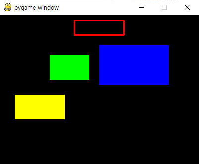

 

+ [배경에 원,타원그리기](./PygamePrac/PygameTwo.py)

사진접기/사진펼치기

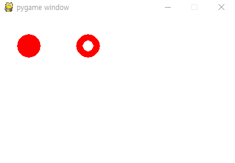

+ [배경에 선,격자무늬 그리기](./PygamePrac/PygameThree.py)

사진접기/사진펼치기

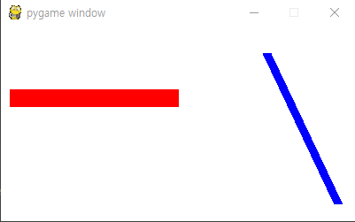
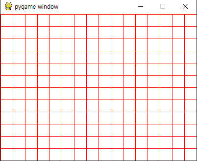

+ [배경에 임의의점을 잇는 선그리기](./PygamePrac/PygameFour.py)

사진접기/사진펼치기

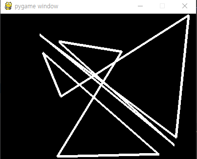

+ [폴라곤그리기](./PygamePrac/PygameFive.py)

사진접기/사진펼치기

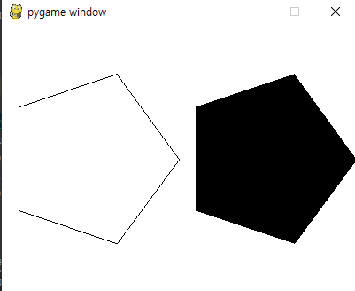

+ [이미지파일불러오고 회전시키기](./PygamePrac/PygameSix.py)

사진접기/사진펼치기

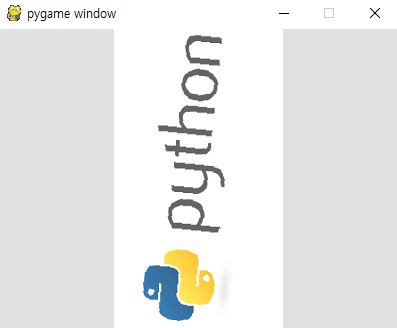

+ [글자불러오고 줌인회전시키기](./PygamePrac/PygameSeven.py)

사진접기/사진펼치기

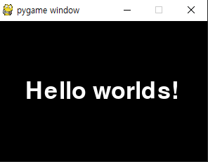

+ [마우스로 점찍기](./PygamePrac/PygameEight.py)
+ [마우스이동으로 글 혹은 그림 그리기](./PygamePrac/PygameNine.py)

사진접기/사진펼치기

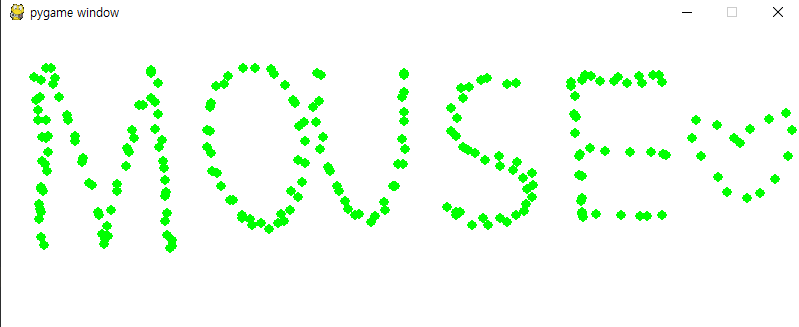

+ [키다운으로 이미지 옮기기](./PygamePrac/PygameTen.py)

사진접기/사진펼치기

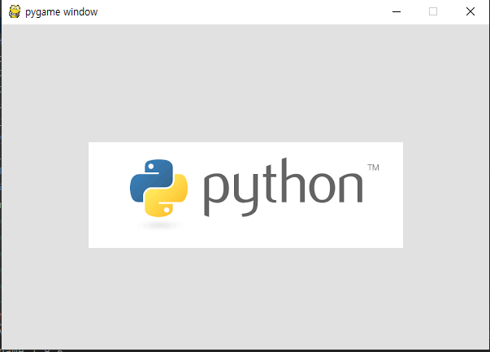

+ [Cos,Sin이용 별모양 그리기](./PygamePrac/PygameEleven.py)

사진접기/사진펼치기

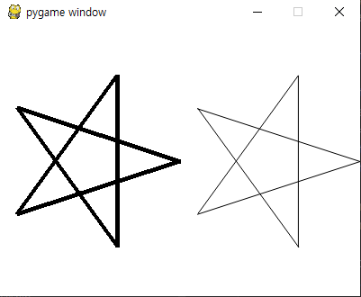

+ [클래스와 상속에 관한 코드](./PygamePrac/PygameTwelve.py)  

