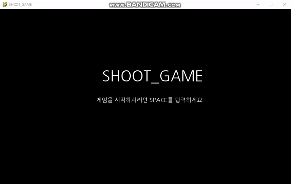

 # SHOOTING 게임을 만들어보자!
   
  <br>
   
 
 
  <br>
 
  + 서로 다른 크기의 박스가 나오고 미사일을 발사하여 박스를 없애는 게임입니다!
 
 ### 코드 설명
 
 <br>
 
 + [Shooting게임](../GamePrac/SHOOT.py)
 
 <br>
 
 ```buildoutcfg
#기본적인 설정
import random
import pygame
import sys
from pygame.locals import QUIT, KEYDOWN, K_UP,K_DOWN,K_SPACE,K_a,Rect

pygame.init()
pygame.display.set_caption('SHOOT_GAME')
pygame.key.set_repeat(15,15)
SURFACE = pygame.display.set_mode((1000,600))
FPSCLOCK = pygame.time.Clock()
Big_font = pygame.font.Font('NanumGothic.ttf', 50)
Small_font = pygame.font.Font('NanumGothic.ttf', 20)
```
 
 <br>

 + 모듈을 불러오고 파이게임의 화면과 키의 반복기능, 게임창에 적을 이름들을 표시해줍니다. 그리고 작은글씨와 큰글씨를 지정해줍니다.

 <br>
 
 ```buildoutcfg
#그림그리기 클래스
class Draw:
    def __init__(self,col,rect,speed = 0):
        self.col = col
        self.rect = rect
        self.speed = speed
    def move(self):
        self.rect.centerx += self.speed
    def draw_E(self):
        pygame.draw.ellipse(SURFACE,self.col,self.rect)
    def draw_R(self):
        pygame.draw.rect(SURFACE,self.col,self.rect)
```
 
 <br>

 + Draw 클래스 에서 기본 변수는 색,모양,스피드를 지정해주고 클래스에 속해있는 함수로써 move와 타원을 그리기, 사각형을 그리기를 만들어줍니다.
 move 함수의 경우에 지정된 스피드만큼 도형을 이동시킬수 있습니다.

 <br>

 
 ```buildoutcfg
#게임기본화면틀 지정
def Game_Border():
    Start_Point = [(100,150),(100,150),(100,550),(900,150)]
    End_Point = [(100,550),(900,150),(900,550),(900,550)]
    for index in range(len(Start_Point)):
        pygame.draw.line(SURFACE,(255,255,255),Start_Point[index],End_Point[index])
```
 
 <br>

 + 기본적인 게임틀을 만들어줍니다. 포인트들을 정해서 선을 그어줍니다. 가로세로로 큰 사각형을 만들어 줍니다.

 <br>

 
 ```buildoutcfg
#메인함수의 변수들
def main():
    rock_speed = -5
    RockWIDTH = 50
    RockHEIGHT = 50
    xpos = 880
    ypos = random.randint(0,8)
    Rock = []
    game_start = False
    Miss = 0
    Score = 0
    Beam_Count = 0
    Cir = Draw((255, 255, 255), Rect(50,300, 30,30))
    Beam = Draw((255, 255, 0), Rect(Cir.rect.centerx, Cir.rect.centery, 5, 5), 10)
```
 
 <br>

 + rock_speed를 -부호로 표시한 이유는 rock이 오른쪽에서 왼쪽으로 이동해야하기때문에 지정해준것입니다. 그리고 게임시작을 표시하는 변수 game_start와
 놓친갯수, 스코어, 빔이 나가고 있음을 표시하는 변수를 정해줍니다. Cir 이라는 변수와 Beam이라는 변수를 Draw클래스를 활용하여 생성하여 줍니다.

 <br>

 
 ```buildoutcfg
    #메세지 출력
    while True:
        message_Title = Big_font.render("SHOOT_GAME", True, (255, 255, 255))  # 게임제목 적기
        message_Score = Small_font.render("Score: {}".format(Score), True, (255, 255, 255))  # 스코어
        message_Miss = Small_font.render("Miss_Point: {}".format(Miss), True, (255, 255, 255))  # 놓친장애물수
        message_game_start = Small_font.render("게임을 시작하시려면 SPACE를 입력하세요", True, (255, 255, 255))  # 게임시작
        message_game_over = Big_font.render("게임오버 점수 : {}".format(Score), True, (255, 255, 255))  # 게임오버
        message_caution = Small_font.render("주의 ! 미사일 버튼 : A! 미사일은 1개씩만 발사됩니다. ", True, (255, 255, 255))
        SURFACE.fill((0, 0, 0))
```
 
 <br>

 + 메세지 출력을 while문 안에 적어주는 이유는 score와 Miss가 실시간으로 변화하기때문에 그 변화량을 계속 메세지로 변화해서 보여야 하기 때문입니다.
 message_Score 과 message_Miss를 제외하고는 while문 바깥에 적으셔도 무방합니다. (단, 메세지는 내용에따라 본인이 원하는 내용으로 바꾸셔도 무방합니다.)

 <br>

 
 ```buildoutcfg
        #pygame의 이벤트
        for event in pygame.event.get():
            if event.type == QUIT:
                pygame.quit()
                sys.exit()
            elif event.type == KEYDOWN:
                if event.key == K_SPACE:
                    rock_speed = -5
                    Miss = 0
                    Score = 0
                    game_start = True
                elif event.key == K_UP:
                    Cir.rect.centery -= 10
                elif event.key == K_DOWN:
                    Cir.rect.centery += 10
                elif event.key == K_a:
                    if Beam_Count == 0:
                        Beam_Count =1
                        Beam.rect.center = Cir.rect.center
                    else:
                        Beam.draw_E()
                        #Beam.move() a를 계속 누르고 잇으면 빔속도가 빨라진다.
```
 
 <br>

 + 파이게임 이벤트설정입니다. QUIT은 종료를 의미하고 KEYDOWN을 통해 내가 움직일 공의 좌표를 바꾸어줍니다. 그리고 스페이스바를 통해 게임을
 시작하는 기능을 넣어주었습니다. 미사일 공격버튼은 a버튼으로 빔이 나가게 되면 빔카운트를 1로 바꾸어주고 빔이 정확하게 플레이어의 중심에서 나갈수
 있도록 설정해줍니다. 그리고 만약 빔이 발사중이라면 계속 유지해서 그려줍니다.Beam.move의 경우는 추가하고 싶다면 추가하고 빼시려면 빼도 무방합니다.

 <br>

 
 ```buildoutcfg
        #게임이 시작되었을 때
        if  game_start:
            SURFACE.blit(message_Title, (350, 20))  # 화면상에 제목 표시
            SURFACE.blit(message_Score, (770, 160))  # 화면상에 스코어 표시
            SURFACE.blit(message_caution,(280,100)) #화면상에 주의사항 표시
            SURFACE.blit(message_Miss,(770,180)) #놓친블럭수 표시
            Game_Border()
            Cir.draw_E()

            if Cir.rect.centery <= 170:
                Cir.rect.centery = 170
            elif Cir.rect.centery >= 530:
                Cir.rect.centery = 530
```
 
 <br>

 + 게임이 실행되면 화면상에 제목,스코어,놓친블럭,주의사항을 표시해주고 기본게임틀과 플레이어 공을 그려줍니다. 그리고 플레이어의 위치를  지정해주어 바깥으로
나가지않도록 만들어 줍니다. (적당한 값으로 지정하였습니다.)

 <br>

 
 ```buildoutcfg
            #빔이 발사되고있을 때
            if Beam_Count == 1:
                Beam.draw_E()
                Beam.move()
                if Beam.rect.centerx >= 900:
                    Beam.rect.center = Cir.rect.center
                    Beam_Count = 0
```
 
 <br>

 + 빔이 발사되고 있을 때 계속 해서 그려주고 미사일을 움직여줍니다. 만약 빔의 중심좌표가 900을 넘어간다면 빔을 없애줍니다.

 <br>

```buildoutcfg
            #바위의 출현
            if len(Rock) == 0:
                Rock.append(Draw((0, 255, 0), Rect(xpos, ypos * 40 + 170, RockWIDTH - ypos*3 , RockHEIGHT - ypos*3), rock_speed))
            elif len(Rock) ==1:
                Rock[0].draw_R()
                Rock[0].move()
                if Rock[0].rect.colliderect(Beam.rect):
                    Beam.rect.center = Cir.rect.center
                    Beam_Count = 0
                    Score +=100
                    rock_speed -=0.25
                    del Rock[0]
                    ypos = random.randint(0, 8)
                elif Rock[0].rect.centerx <= 100:
                    Beam.rect.center = Cir.rect.center
                    Beam_Count = 0
                    Miss +=1
                    del Rock[0]
                    ypos = random.randint(0, 8)
            if Miss == 3:
                game_start = False
```

<br>

 + 등장하는 박스를 1개씩으로 지정하기 위한 코드입니다. 등장하는 박스의 크기를 랜덤으로 바꾸어주고 Rock의 리스트에 추가합니다. 그리고 만약에 한개의
 리스트항목이 발생하게 되면 박스를 출발시킵니다. 만약 박스와 빔이 만나게 되면 점수를 100점 올리고 등장하게 되는 박스의 속도를 추가해줍니다.그리고 다음블럭을 
 생성하기위해서 방금 등장한 첫번째 리스트항목을 제거하고 y좌표를 다시 임의로 설정합니다. 만약에 빔과 만나지못하고 Rock의 x좌표가 100이하로 떨어진다면
 Miss를 하나씩 늘이고 박스를 다시 생성해줍니다. 놓친박스가 3개가 된다면 게임은 종료되게됩니다.
 
 <br>

```buildoutcfg
        #game_start가 True 가아닌상황들
        elif not game_start and Miss ==3:
            SURFACE.blit(message_game_over, (330, 200))
            SURFACE.blit(message_game_start, (330, 300))
        else:
            SURFACE.blit(message_Title, (350, 200))
            SURFACE.blit(message_game_start, (330, 300))

        pygame.display.update()
        FPSCLOCK.tick(30)

if __name__ == '__main__':
    main()
```

<br>

 + game_start = False인경우를 2가지로 나눈 이유는 첫번째 화면에서 게임스타트시 화면과 게임이 종료되고 난후의 스코어 표시와 다시시작을 하기위해서 나누어 놓았습니다.
파이게임 화면에 띄우기로하고 main함수를 불러옵니다.
 
 <br>
 
 ### 코드를 짜서 게임을 만들어봅시다! 심화응용으로 빔의 갯수늘리기 혹은 빔이 발사 도중 다시 발사할 수있는 코드들을 만들어봅시다.