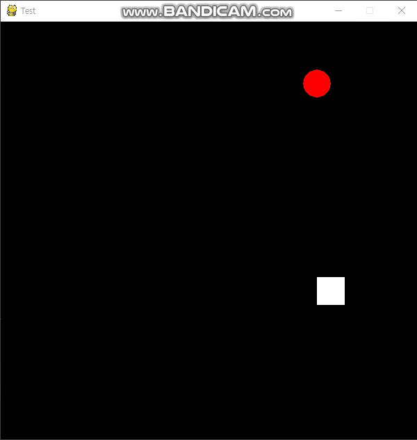

# 도형 계속 지나가기

 + [도형 계속 지나가기](../GamePrac/Prac3.py)
 
 <br>
 
 + 
 
 <br>
 
 + 도형이 계속 해서 화면을 통과하여 지나갑니다.
 
 
```buildoutcfg
import pygame
import sys
from pygame.locals import QUIT,Rect
```

<br>

 + 파이게임, 시스템 모듈을 가져옵니다. 사각형을 그리기위해 Rect 기능을 가져옵니다.
 그리고 창을 닫으면 게임이 종료되는 기능을 가져옵니다.
 
 <br>
 
 ```buildoutcfg
pygame.init()
WIDTH = 600
HEIGHT = 600
SURFACE = pygame.display.set_mode((WIDTH,HEIGHT)) #화면의 크기
pygame.display.set_caption("Test") #게임의 이름정하기
FPSCLOCK = pygame.time.Clock() ##pygame의 프레임을 설정한다
```

<br>

 + pygame.init()는 파이게임의 초기화를 설정해줍니다. 반드시 필요한 코드입니다.
 그리고 WIDTH와 HEIGHT는 화면의 크기를 정해줍니다.
 
 <br>
 
 + 다음은 main함수에 대해서 알아봅시다.
 
 ```buildoutcfg
def main():
    x_pos = 600
    while True:
        for event in pygame.event.get():
            if event.type == QUIT:
                pygame.quit()
                sys.exit()
        x_pos -= 5
        if x_pos < 0:
           x_pos = 600
```

<br>
 
+ 변수로써 x_pos의 기본값을 설정해줍니다. 그리고 파이게임의 이벤트속성을 가지고와서
QUIT를 지정해줍니다. 파이게임창을 닫을 시에 파이게임시스템이 종료됩니다.그리고 반복문이
계속 진행되는 동안 x_pos의 값을 5씩 감소시켜줍니다. 그리고 0이하가 된다면 다시 600으로 보내주어
다시 지나가는 무한 반복을 시켜줍니다.

<br>

```buildoutcfg
        SURFACE.fill((0,0,0))
        pygame.draw.circle(SURFACE, (255, 255, 255), (pos_x,pos_y), 20)
        pygame.display.update()
        FPSCLOCK.tick(30)
```

<br>

 + 화면을 검은색으로 가득채우고 draw기능을 활용하여 화면에 원을 그립니다.
 pygame.display.update()를 통해 파이게임을 동작시키고 프레임을 30으로 맞춰줍니다.
 
 <br>
 
 ```buildoutcfg
 if __name__ == "__main__":
    main()
```
 
 <br>
 
  + Run시에 메인함수를 불러오면서 화면을 띄우고 시작하게 됩니다.
  
 ### 응용학습으로 y값을 랜덤으로 주어 공이 생기는 위치를 랜덤으로 해봅시다!
 
 [공랜덤 생성](../GamePrac/Prac4.py)