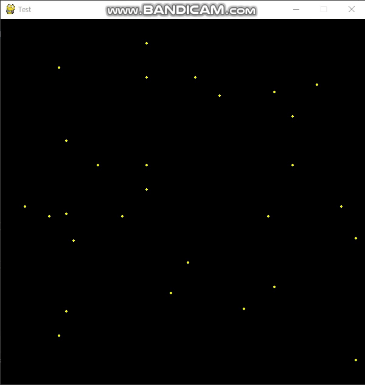
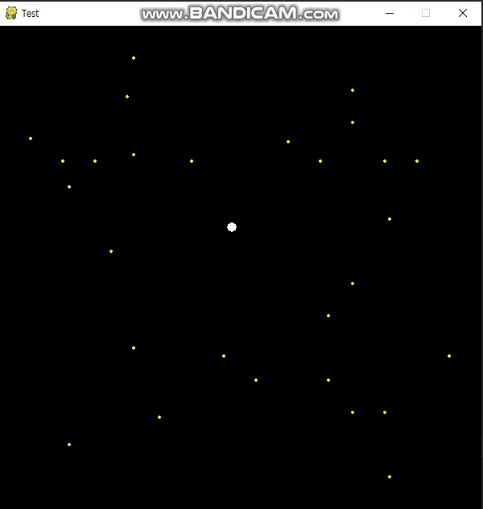

# 떨어지는 공을 피해보자!

+ ### [공이반사되유](../GamePrac/Prac8.py)

 <br>
 
 
 
 <br>
 
 ## 코드 설명하기
 
 ```buildoutcfg
import pygame
import sys
import random
from pygame.locals import QUIT


WIDTH = 600
HEIGHT = 600
pygame.init()
pygame.display.set_caption("Test")
SURFACE = pygame.display.set_mode((WIDTH, HEIGHT))
FPSCLOCK = pygame.time.Clock()
```

<br>

 + 기본모듈과 화면창을 만들어 줍니다.
 
 <br>
 
 + 메인함수 설명입니다.
 
 ```buildoutcfg
def main():
    rdx_posx = []
    rdx_posy = []
    rdy_posx = []
    rdy_posy = []
    velocity_y = []
    velocity_x = []
    for i in range(1,15):
        i *= 40
        rdx_posx.append(i)
        rdx_posy.append(0)
        velocity_y.append(random.randint(3, 14))
        rdy_posx.append(0)
        rdy_posy.append(i)
        velocity_x.append(random.randint(3, 14))
```

<br>

+ rdx 리스트들은 위에서 떨어지는 공들의 좌표를 정해주기 위해서 만든 리스트입니다.
그리고 rdy 리스트들은 옆에서 지나가는 공들의 좌표를 정해주기 위해서 만든 리스트입니다.
속도를 임의의 값을 지정하여 공들의 속도를 다르게 하여줍니다.

<br>

```buildoutcfg
 while True:
        SURFACE.fill((0, 0, 0))
        for event in pygame.event.get():
            if event.type == QUIT:
                pygame.quit()
                sys.exit()
```

<br>

```buildoutcfg
        for i in range(len(rdx_posx)):
            pygame.draw.circle(SURFACE, (255, 255, 0), (rdx_posx[i], rdx_posy[i]), 2)
            pygame.draw.circle(SURFACE, (255, 255, 0), (rdy_posx[i], rdy_posy[i]), 2)
            if rdx_posy[i]<0 or rdx_posy[i] > 600 :
                velocity_y[i] *= -1
            if rdy_posx[i]<0 or rdy_posx[i] > 600 :
                velocity_x[i] *= -1
            rdx_posy[i] += velocity_y[i]
            rdy_posx[i] += velocity_x[i]
```

<br>

+ 정해진 좌표에따라 circle을 생성하고 무작위로 정해진 속도에 따라 공들의 y좌표 혹은 x좌표를 바꾸어줍니다.
만약 공이 화면밖으로 나가려고 하면 속도값에 -1을 곱해주어 다시 반대로 돌아오도록 해줍니다. 이 작업이 공이 화면에 튕겨 반사되는것 처럼
보이도록 합니다.

<br>

```buildoutcfg
        pygame.display.update()
        FPSCLOCK.tick(30)

if __name__ == "__main__":
    main()
```

+ 게임을 실행 시켜 줍니다.

### 응용학습으로 상하좌우로 반복되며 랜덤속도를 가진 공을 피하는 게임을 만들어봅시다!

+ ### [공피하기](../GamePrac/Prac9.py)

