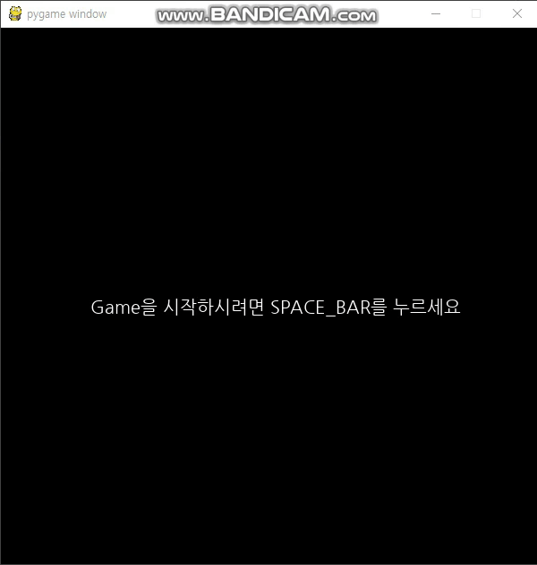

# Dodge_Game을 만들어보자!

+ ### [DOdge_Game 소스코드](../GamePrac/Avoid_The_Ball.py)

<br>



<br>

 + ## 소스 분석하기!
 
 + #### 원래 닷지 게임은 기존의 마우스를 사용하지만 이 게임은 키보드 자판을 기반으로 하는 닷지 게임입니다.
 
 <br>
 
  
 ```buildoutcfg
import sys
import pygame
import random
import math
from pygame.locals import QUIT, KEYDOWN, K_LEFT,K_RIGHT,K_UP,K_DOWN, K_SPACE,Rect
```

<br>

 + 랜덤변수와 cos sin 함수를 사용할 예정이므로 math 와 random 모듈을 가지고옵니다 그리고 SPACE바를 누르는 순간 게임을 진행할것이기
 때문에 K_SPACE 를 추가해줍니다.
 
 <br>
 
 ```buildoutcfg
class Block:
    def __init__(self,col,rect,speed = 0): #col:채우는색, rect:그리는 직사각형(위치,크기), speed(이동속도,공만),dir(이동방향, 공만)
        self.col = col
        self.rect = rect
        self.speed = speed
        self.dir = random.randint(-90, 90) +215

    def move(self):#공을 움직인다 , radians를 사용해서 dir을 라디안으로 변환, X축과Y축의 방향성분구분
        self.rect.centerx += math.cos(math.radians(self.dir)) * self.speed
        self.rect.centery -= math.sin(math.radians(self.dir)) * self.speed
    def draw(self):
        pygame.draw.ellipse(SURFACE, self.col, self.rect)
```

<br>

 + 다음은 클래스에 대한 설명입니다. Block이라는 클래스를 생성하여 col, rect, speed, dir 를 지정해줍니다 그리고
 함수 move를 상속시켜 공을 움직이는데 이떄 cos과 sin을 이용해 x축과 y축을 구분시켜 줍니다. radians를 사용하여  dir를 라디안으로
 변환시켜 사용하여줍니다. 그리고 draw함수는 화면상에 공을 그려보여줍니다.
 
 <br>
 
 ```buildoutcfg
WIDTH = 600    # 화면창의 가로크기
HEIGHT = 600   # 화면창의 세로 크기
pygame.init()  # 파이게임 실행시 반드시 필수! 초기화시키는 코드
pygame.key.set_repeat(10,10) # 키보드누름에 있어 연속성을 부여
SURFACE = pygame.display.set_mode((WIDTH,HEIGHT)) #화면창 생성
FPSCLOCK = pygame.time.Clock() #프레임설정
```

 <br>
 
 + 다음은 메인함수 안의 것들을 설명하겠습니다.
 
 ```buildoutcfg
def main():
    #게임의 시작과 끝
    game_start = False
    game_over = False
```

<br>

 + 먼저 스페이스바를 누르기 전에 게임실행을 막기위한 변수와 게임오버를 표시하는 변수를 지정해줍니다.
 
 <br>
 
 ```buildoutcfg
    #장애물 좌표및 속도 생성
    velocity = []
    rd_pos = []
    zero_pos = []
    Ball_x = []
    Ball_y = []
    for i in range(1, 30):
        i *= 20
        rd_pos.append(i)
        zero_pos.append(0)
        velocity.append(random.randint(3,8))
```

<br>

 + 속도를 랜덤으로 넣을 리스트, 랜덤 좌표리스트와 0을 저장할 리스트를 만들어줍니다. 여기서 각각의 리스트로 나눠서 저장하는 이유는
 공하나하나 마다 속도와 위치를 정해주기 위함입니다. 그리고 좌표값과 속도를 동시에 저장할 Ball_x, Ball_y리스트를 생성해주고 약 30개의
 장애물을 저장해줍니다.
 
 <br>
 
 ```buildoutcfg
    #내캐릭터생성
    posx = 300
    posy = 300
    Cir = Block((255,255,255), Rect(posx, posy, 8, 8)) #(x좌표,y좌표,가로길이,세로길이)
```

<br>

 + 내가게임에서 조정할 공을 만들어줍니다. 화면의 중간에서 시작하기위해 300,300을 지정하였습니다.
 
 <br>
 
 ```buildoutcfg
    #폰트지정
    Small_font = pygame.font.Font('NanumGothic.ttf',20)
    Big_font = pygame.font.Font('NanumGothic.ttf', 40)
    message_start = Small_font.render("Game을 시작하시려면 SPACE_BAR를 누르세요",True,(255,255,255))
    message_over = Big_font.render("Game Over", True, (255, 255, 255))
```

<br>

 + 폰트를 지정하고 변수에 게임시작 메세지와 게임오버 메세지를 지정해놓습니다.
 
 <br>
 
 ```buildoutcfg
    # 이벤트 키 설정
    while True:
        SURFACE.fill((0, 0, 0))
        for event in pygame.event.get():
            if event.type == QUIT:
                pygame.quit()
                sys.exit()
            elif event.type == KEYDOWN:
                if event.key == K_LEFT:
                    Cir.rect.centerx -= 10
                if event.key == K_RIGHT:
                    Cir.rect.centerx += 10
                if event.key == K_UP:
                    Cir.rect.centery -= 10
                if event.key == K_DOWN:
                    Cir.rect.centery += 10
                if event.key == K_SPACE:
                    game_start = True
```

<br>

 + Cir변수에 저장된 공을 움직이는 코드입니다. 상하좌우로 움직이며 SPACE 를 누르면 game_start변수가 False에서 True로 변경되고
 게임이 시작됩니다.
 
 <br>

```buildoutcfg
        if game_start == False:
            SURFACE.blit(message_start, (100, 300))
        else:
            Cir.draw()
            if game_over == True:
                SURFACE.blit(message_over,(200,300))
            if Cir.rect.centerx > 590:
                Cir.rect.centerx = 590
            elif Cir.rect.centerx <10:
                Cir.rect.centerx =10
            if Cir.rect.centery > 590:
                Cir.rect.centery= 590
            elif Cir.rect.centery <10:
                Cir.rect.centery =10
```

<br>

 + 만약에 game_start == False이면 게임시작을 알리는 메세지를 띄워주고 스페이스바를 눌러 game_start변수를 True로 바꾸어주면
 내가 조종하는 공을 그리고 창밖으로 나가지않게 값을 설정해줍니다. 그리고 game_over 시에 메세지를 작성한다고 적어줍니다.
 
 <br>
 
 ```buildoutcfg
            #장애물 그리기
            for i in range(len(rd_pos)):
                Ball_x.append(Block((255, 255, 0), Rect(rd_pos[i], zero_pos[i], 2, 2),velocity[i]))
                Ball_y.append(Block((255, 255, 0), Rect(zero_pos[i], rd_pos[i], 2, 2),velocity[i]))
                Ball_x[i].draw()
                Ball_y[i].draw()
                if Ball_x[i].rect.centery < 1000:
                    Ball_x[i].move()
                if Ball_y[i].rect.centery < 1000:
                    Ball_y[i].move()
```

<br>

+ 저장해놓았던 좌표들과 속도를 가지고 장애물들을 그려줍니다. 그리고 공의 y좌표가 1000이하 일때는 계속해서 움직여준다는 코드를 작성합니다
여기서 1000을 적은 이유는 y좌표 범위인식이 잘될수있게 넉넉하게 잡아준 것입니다.

<br>

```buildoutcfg
                # 벽에 반사
                if Ball_x[i].rect.centery < 0 or Ball_x[i].rect.centery >600:
                    Ball_x[i].dir = - Ball_x[i].dir
                if Ball_y[i].rect.centery < 0 or Ball_y[i].rect.centery > 600:
                    Ball_y[i].dir = - Ball_y[i].dir
                if Ball_x[i].rect.centerx < 0 or Ball_x[i].rect.centerx >600:
                    Ball_x[i].dir = 180 - Ball_x[i].dir
                if Ball_y[i].rect.centerx < 0 or Ball_y[i].rect.centerx > 600:
                    Ball_y[i].dir = 180 - Ball_y[i].dir
```

<br>

 + 벽에 부딪혓을때 반사되는것을 뜻합니다. 화면 위 아래에 부딪히면 방향을 반대로 하고 좌우로 부딪히면 반사각에의해
180 - 라디안 으로 표현해주어 반사시켜 줍니다.

<br>

 ```buildoutcfg
                #충돌 판단
                if Cir.rect.colliderect(Ball_x[i].rect) or Cir.rect.colliderect(Ball_y[i].rect):
                    game_over = True
```

<br>

 + 만약에 장애물과 내가 움직이는 공이 부딪힐시에 게임오버는 True가 되고 준비된 메세지가 창에 표시되게 됩니다.
 
 ```buildoutcfg
        pygame.display.update()
        FPSCLOCK.tick(30)

if __name__ == "__main__":
    main()
```

 + 마지막으로 화면에 표시해주고 프레임을 30정도로 잡아줍니다. 그 후, 게임을 실행하면 됩니다.

<br>

 ### Dodge 게임을 만들어 보았습니다. 스스로 게임오버시에 어떻게 할지 고민해보고 응용해봅시다!