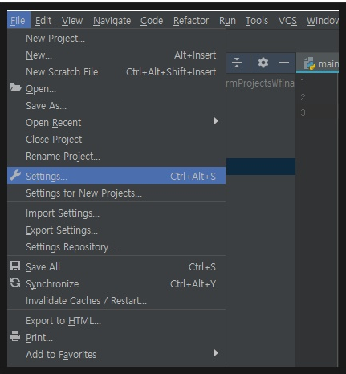
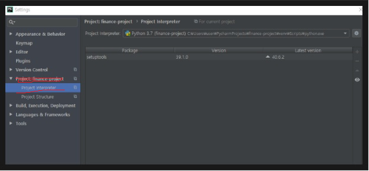
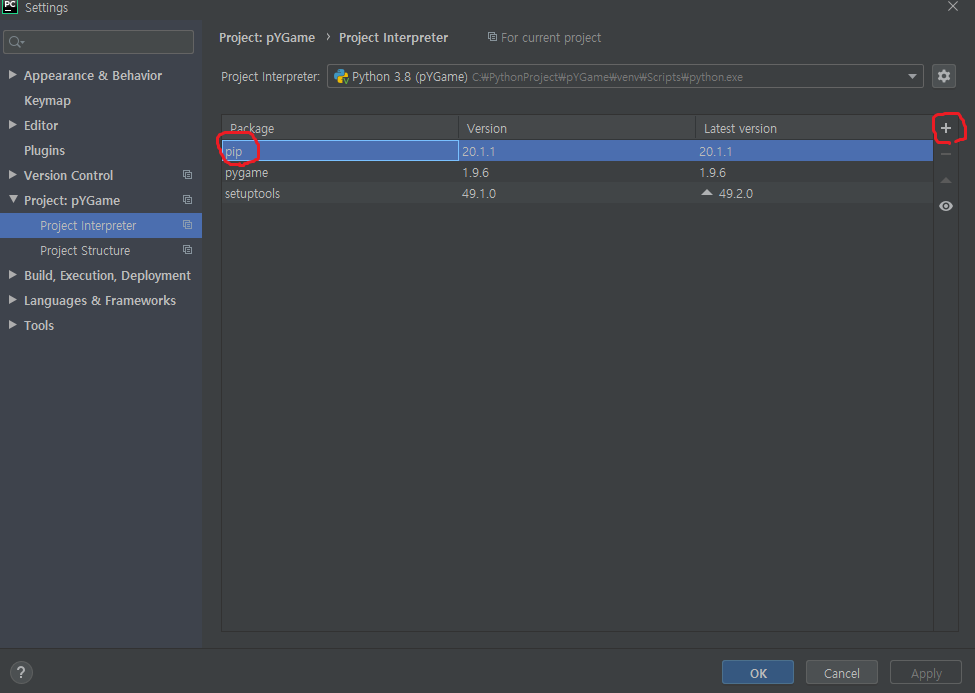
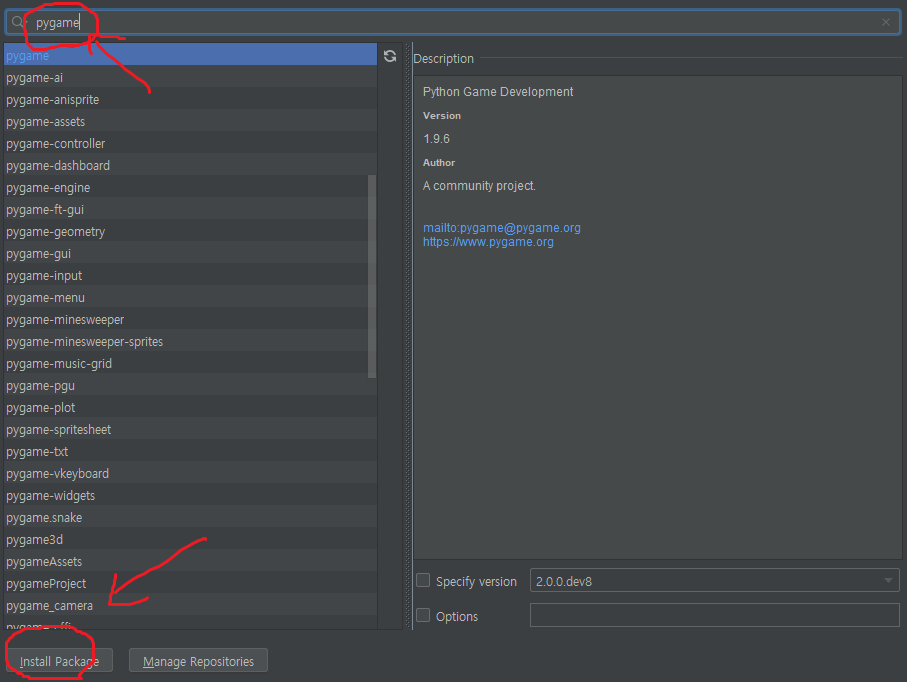

## 파이게임을 설치해보자!

이미 파이참까지 다 설치했다면 파이게임을 설치하는 것을 굉장히 쉽습니다.

맨오른쪽 상단에서 파일을 클릭해서 Settings 을 클릭해줍니다.

만든폴더를 선택하고 밑줄 친부분을 클릭합니다. 지금은 pip이라는 install package tool이설치되있지
않아서 add+버튼이 클릭되지않는데 설치되지않을시에 맨밑에 파란알림이 뜨므로 그것을 설치해줍니다.

설치가 완료되면 pip이 설치되어있고 +가 활성화 됨을 알수있습니다. +를 눌러줍니다.

검색창에 pygame을 검색하고 install Package를 눌러줍니다. 

이상 파이게임 설치까지 마무리하였습니다 이제부터 개발을 시작합시다!