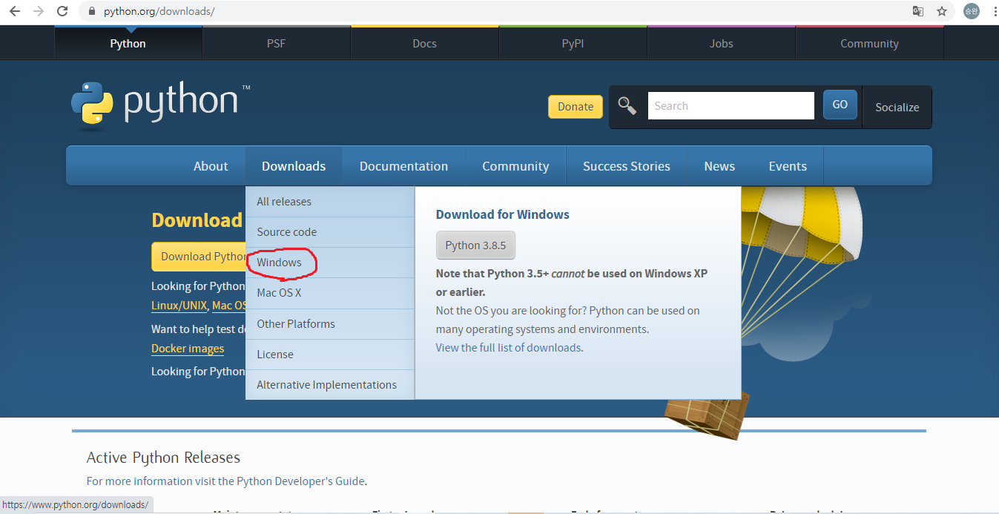
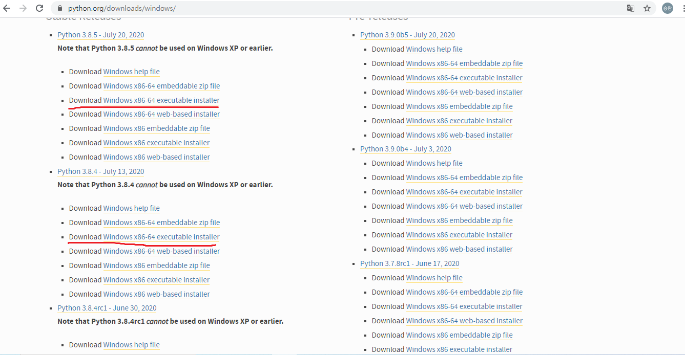
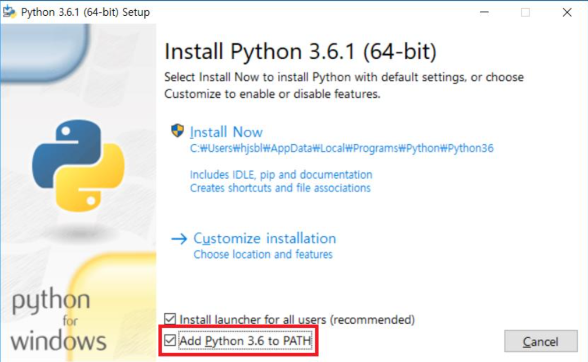

## 파이썬을 설치하자!

###파이썬이란?
파이썬은 읽고 쓰기 쉽게 프로그래머의 효율을 높이기위해 만들어진 프로그래밍 언어입니다.
풍부한 라이브러리를 가지고 있고, 간단하고 간결한 언어이므로 다른 언어에 비해 문법을 
외우는 것이 쉬운것이 특징입니다. 자 그럼 이제 파이썬을 설치 해봅시다.

먼저 아래의 링크를 통해 홈페이지에 접속합니다.

[파이썬다운로드링크](https://www.python.org/downloads/)

다운로드에 마우스를 올리고 Windows를 클릭합니다.

자신의 PC에 맞춰 적절한 인스톨러를 선택하고 설치합니다. 빨간줄은 일반 컴퓨터
기준에 맞추었습니다.

모든체크박스에 체크를 해주고 설치가 종료되면 파이썬이 안전하게 설치되었습니다.
참 쉽죠? 모든설치가 끝난사람은 파이참을 설치하러 갑시다!

+ [파이참 설치하기](../Readme/PytC.md)
