## 파이참을 설치하자!

### 파이참이란?
Python 언어에 사용되는 IDE입니다. IDE란 통합개발환경을 말합니다.
IDE가 보편화 되기전에는 컴파일러를 사용해서 컴파일해서 실행파일을 만들고 하였으나 
그 불편함을 개선 하기 위해서 만든것이 IDE입니다. 한마디로 빠르게 코딩하고 컴파일하기위해
파이참을 사용하도록 하겠습니다!

먼저 아래의 링크를 클릭하거나 검색창에 pycharm이라고 검색합니다.

[Pycharm홈페이지 바로가기](https://www.jetbrains.com/ko-kr/pycharm/download/#section=windows)

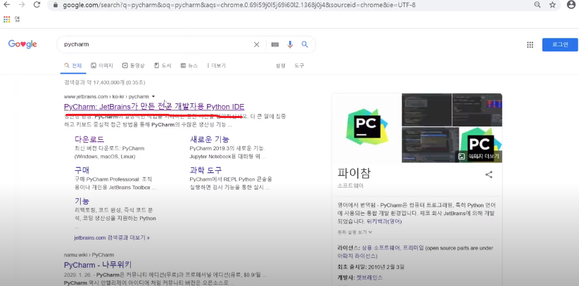

홈페이지에 들어가서 오른쪽 상단의 다운로드를 클릭합니다

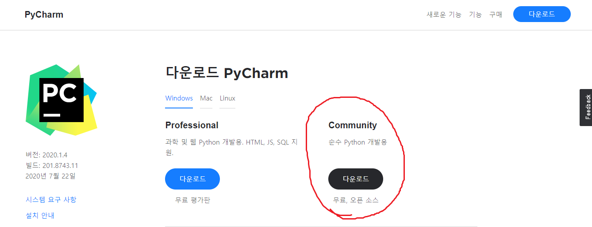

그 후 Windows / Mac / Linux 중 본인컴퓨터에 맞게 선택한 후 Community를 클릭합니다.
그러면 홈페이지가 넘어가면서 자동으로 다운받게 되니 조금 기다려줍니다.
그리고 다운받은 파일을 실행해줍니다.

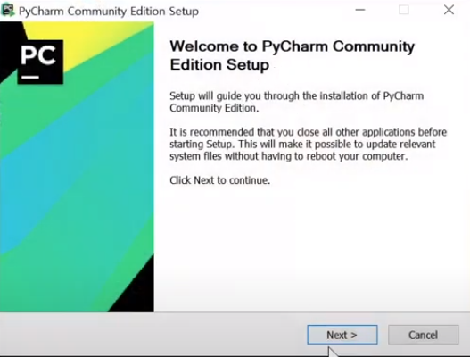

이러한 창이뜨게되면 next를 클릭합니다.

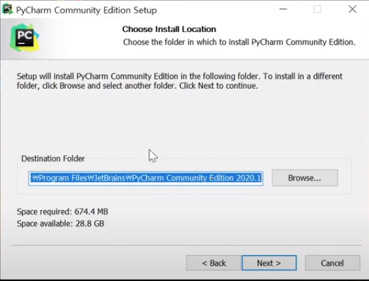

기본설치장소로 설치해줍니다.

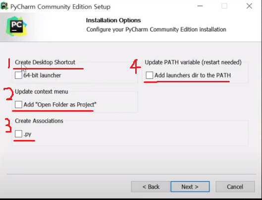

1.바탕화면바로가기 생성인데 필요하신분을 체크해주시고
2.프로젝트폴더열기,3.파이썬확장자.py연결,4.환경변수설정은 전부 체크해주시고 넥스트를눌러주세요.

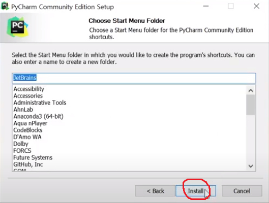

다른변동없이 install을 눌러주세요.

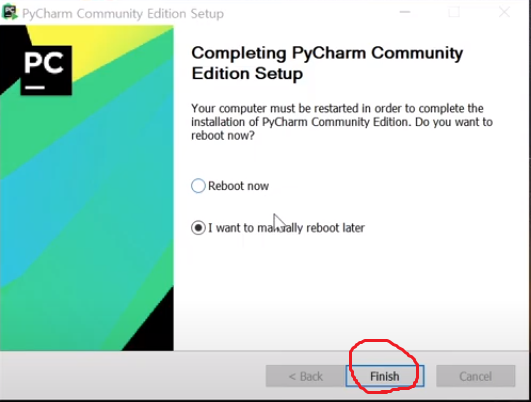

컴퓨터 재부팅에 대해서 묻는데 설치가 잘되었는지 체크하기위해 나중에 재부팅하겠습니다.

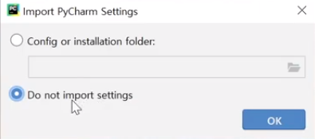

미리 지정된 세팅이 있냐고 물어보는데 없으니 그대로 OK를 클릭합니다.

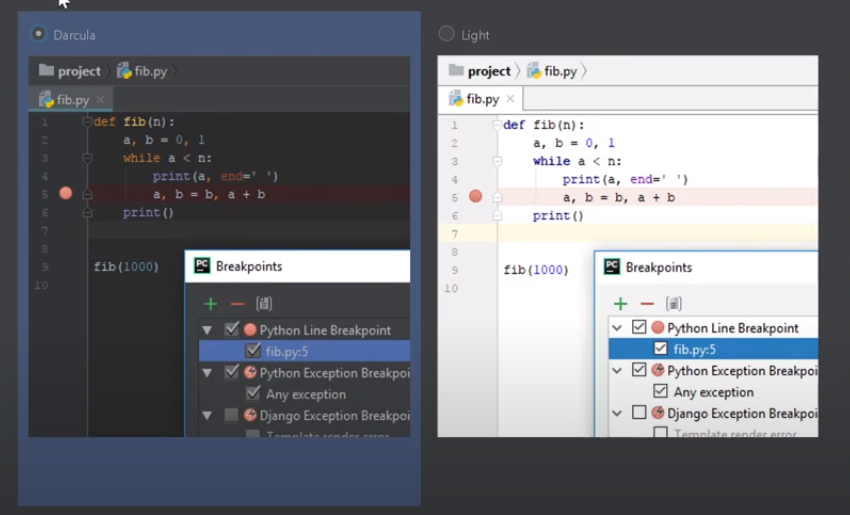

UI를 dark버전 일반버전 둘중에 고르라는 말인데 보시고 원하시는거 하시기바랍니다
(저는 dark추천드려요 눈아파요 흰색 눈아파요..)

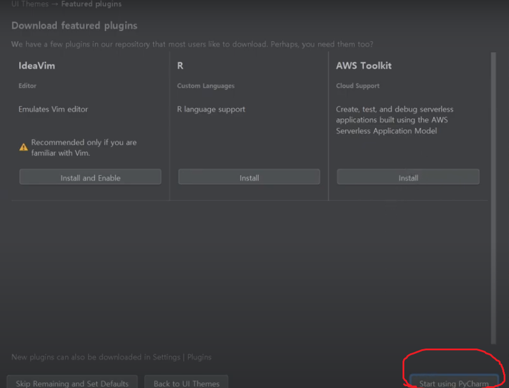

플러그를 설치하겠냐고 묻는 것인데 지금은 필요가 없으니 그냥 넘어가줍니다.

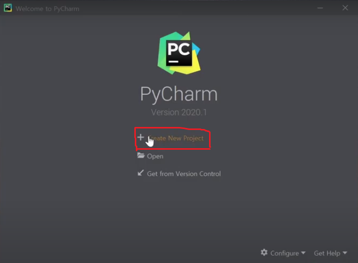

이제 제대로 실행이 되는지 알아보기위해 프로젝트를 만들어봅시다

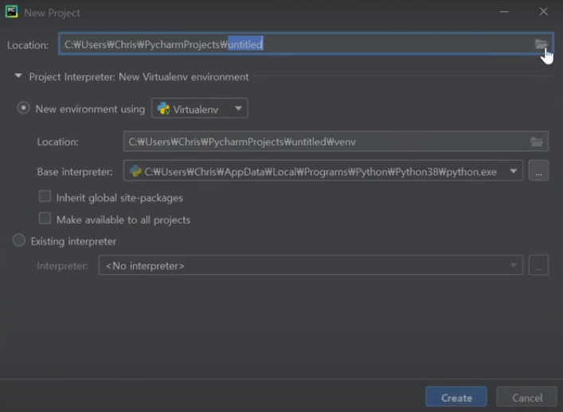

저장공간에 대해 나오는데 편한곳에 폴더를 생성하고 저장소로 사용하겠습니다.

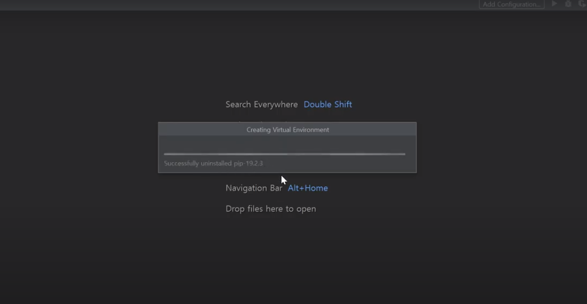

라이브러리와 함께 패키지들을 열고있습니다. 조금만 기다려줍니다.

밑줄친 부분은 가상환경이 잘켜졋다라고 알수있는 부분입니다. 왼쪽위 상단에 venv를 눌러 확인하실 수 있습니다.

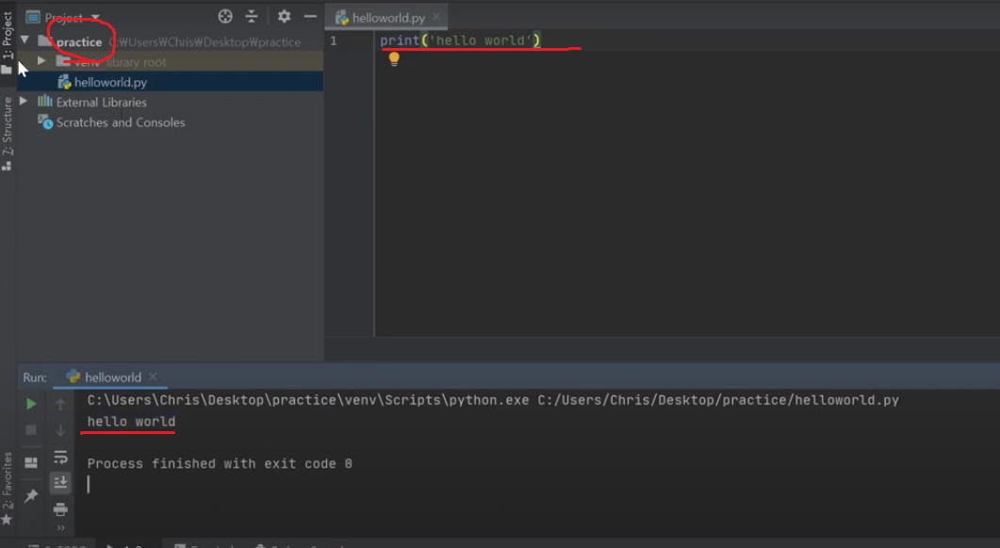

동그라미친 부분을 오른쪽마우스를 눌러 helloworld.py로 파이썬 파일을 만들어줍니다
그리고 오른쪽 상단배너에 초록색 삼각형을 누르면 실행이되고 밑에 RUN에서 helloworld가 나오는 것을 확인하면 성공입니다.

자 이제 파이참을 깔았으니 파이게임패키지를 설치해보겠습니다.

[파이게임 설치하기](../Readme/PyG.md)

