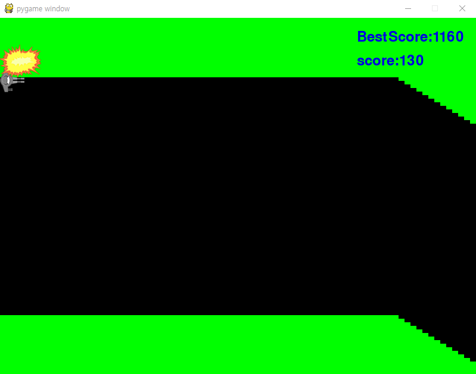

스페이스바를 이용하여 비행기의 높이를 유지하며 동굴을 비행하는 게임입니다.
이 게임은 BEST기록을 저장할수잇는 text파일을 만드는 문법이 들어가있습니다.

[우주선 동굴 통과하기](../GamePrac/PygameCave.py)

### 코드 알아보기
```buildoutcfg
pygame.init()
pygame.key.set_repeat(5, 5)
SURFACE = pygame.display.set_mode((800,600)) #화면크기 설정
FPSCLOCK = pygame.time.Clock()
```
<br>
pygame.init()는 파이게임을 초기화하는 코드입니다. 모든 게임에 필수적으로 들어갑니다.
pygame.key.set_repeat()는 키의 반복기능을 설정하는 메소드입니다.

<br>

```buildoutcfg
for xpos in range(walls):
    holes.append(Rect(xpos *10, 100, 10 ,400))
```
<br>

Rect함수는 파이게임에 정의되어잇는 클래스입니다.인수(X좌표,Y좌표, 폭, 높이)입니다.
X축방향으로 10씩 비키면서 직사각형을 만드는 코드입니다.

<br>

```buildoutcfg
if not game_over:
    score += 10
    velocity += -3 if is_space_down else 3
    ship_y += velocity
```
<br>

스페이스 키의 입력상태에 따라 속도를 +3(하강) -3(상승) 으로 변화시킨다

<br>

```buildoutcfg
edge = holes[-1].copy()
test = edge.move(0,slope)
if test.top <= 0 or test.bottom >= 600:
    slope = randint(1,6) * (-1 if slope >0 else 1)
    edge.inflate_ip(0,-20)
edge.move_ip(10,slope)
holes.append(edge)
del holes[0]
holes = [x.move(-10,0) for x in holes]
```

<br>

edge = holes[walls-1].copy()에서는 오른쪽 끝 직사각형을 복사해서 edge에 저장하는 코드입니다.
결국 배열번호가 0부터 시작되어 walls-1의 마지막 요소를 취득할수 있습니다. 따라서
edge = holes[-1].copy()로 바꿔도 가능합니다.
2번째줄 부터는 새로만든 직사각형을 이동시켜 천장이나 바닥에 부딪히지않는지 검출합니다
부딪힌다면 동굴의 기울기를 반대방향으로 합니다. Y축방향의 크기를 20만큼 작게하고 오른쪽
끝의 직사각형을 X축방향으로 +10 Y축방향으로 slope만큼 이동합니다

<br>

```buildoutcfg
if holes[0].top> ship_y or holes[0].bottom <ship_y + 80:
    game_over = True
```
<br>

ship_y는 내캐릭의 Y좌표입니다. 아래쪽은 ship_y+80으로 해서 비행기가 충돌하는지 체크합니다
이러한 값이 hole[0]범위에 들어가 있는지 조사하는것입니다.

<br>

```buildoutcfg
SURFACE.blit(ship_image,(0,ship_y))
score_image = sysfont.render("score:{}".format(score),True,(0,0,225))
SURFACE.blit(score_image, (600, 60)) #스코어를 표시한다
SURFACE.blit(BestScore_image, (600, 20)) #현재 베스트 스코어를 표시한다.
```

<br>

전체화면을 녹색으로 칠하고 동굴 구멍의 직사각형을 그리고 내캐릭터와 점수를 나타냅니다.

<br>

```buildoutcfg
f= open("BestScore.txt", 'r') #Best 시간 불러오기 텍스트파일은 반드시 폴더에 같이 있어야 하므로 미리 만들기 바랍니다.
BestScore = f.readline()#베스트 점수
BestScore_image = sysfont.render("BestScore:{}".format(BestScore), True, (0, 0, 225))
```

<br>

베스트점수를 text 파일에 저장하고 게임이 실행 될때마다 text에서 점수를 불러와
저장합니다. 그리고 기존의 점수보다 높다면 점수를 수정하고 그렇지않다면 그대로 적어줍니다.

<br>

```buildoutcfg
pygame.display.update()
FPSCLOCK.tick(15)
```

<br>

지금까지의 코드를 파이게임 화면에 동작시켜 게임을 진행합니다.그리고 타이머를 사용해서 FPS를 조정합니다

<br>

```buildoutcfg
if __name__ == '__main__':
    main()
```

<br>

지금 현화면에서 게임을 진행하고 실행할 시 main()함수를 가져옵니다.
